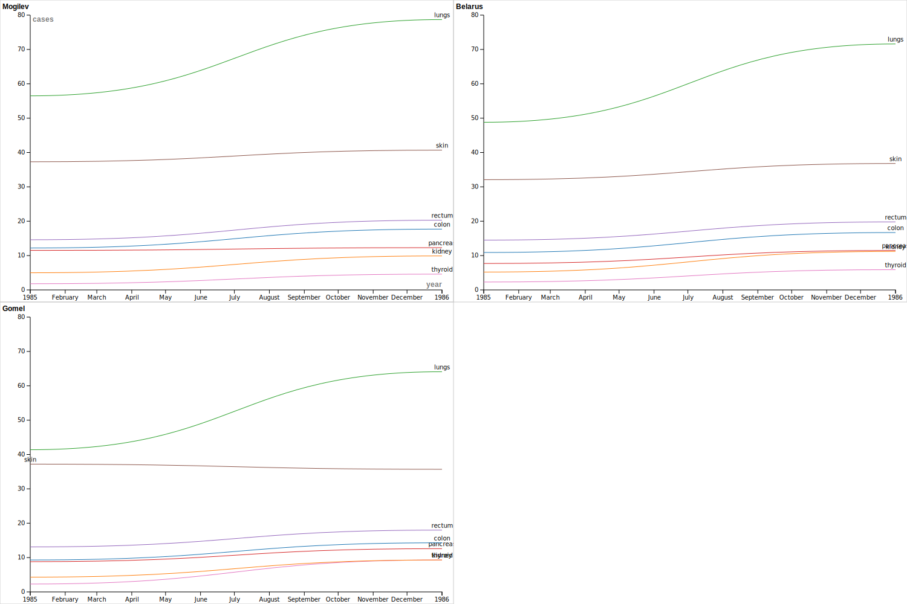

### My Logs for the DSSF Program 

## May 30th 2023

I think the reading and interacting with my group members went well. The computer portion is definetely more challanging than I expected it to be. I think I just need to explore more of these resources on my own time which would help me with being more comfortable with the compsci side of this. This is definetely making me more interested in comspsci and web design. I think I have more questions about markdown and vs code, so far i think they look the same but apparently they are not the same thing. Maybe I will look into it myself. 

also I made this timeline with my partners Sky and Bushra. 
[Timeline](https://cdn.knightlab.com/libs/timeline3/latest/embed/index.html?source=1vnrsy5hCumd_jrUFBMQJgRq6ZJQKWyZenEaa8qKF6vQ&font=Default&lang=en&initial_zoom=2&height=650
)
## May 31st 2023

Today we had the meeting with Jose about the history or more the pop culture and worldwide impacts of the Chernobyl catastrophe. I think that it was very helpful for the team to learn more about the background especially the different ways it was shown in the media. 

Notes I remember from the presentation:
- Stalker (Tarkovsky) was based on Picnic on the Cliff
- Hyperobjects by Timothy Morton(a hyperobject is a philosophical term which encompasses something that surrounds us yet we cannot see it but it is everywhere like climate change or radiation)
- The Chernobyl Herbarium: Fragments of an Exploded Consciousness, a book on how chernobyl impacted people with pictures of radioactive -flowers from the zone
- The Bronze Horseman(Pushkin)
- On saturday(russian film)

Some ideas for project:
1. a model map of places which can have a power plant put in(find patterns and predict locations, for personal effect like oh this can happen to you)
2. effects on medicine and radiation poisoning, how medicine became less stigmatizes and more inclusive
3. compare it to other nuclear disasters such as the precursor of Leningrad and the Pennsylvania one(3 mile island)
4. how nuclear weapons can be used as scare tactics during the current war, and how taking over a NPP can be used to scare others and is a tactical war move
5. how the timing of the chernobyl accident(late 80s) was a deciding factor in whether or not the soviet union stays intact(Gorbachev wanted westernization)
6. the corruption in the government and how the iron curtain may have contributed to the chernobyl accident 
7. how design is a crucial part of the accident and perhaphs how it could be impacted the results(perhaps as a positive note? like oh this could have been prevented and here is how)
8. chernobyl in ao3???

I liked the project management workshop but it definetely could have been shorter, but thats okay. I don't think I have any questions considering that the project still does not have a finalized theme. I wanna work more on the compsci and web design aspect of this, i think it would be fun.

## June 1st 2023

Today we spent sometime in the makerspace in order to get accostomed with different materials and techniques. We also spent some time working with the adobe illustrator. I think its pretty hard right now but I am sure that I will get the hang of it really soon. Maybe I will practice by myself at home later tonight. I was able to design one sticker on my own, a black bunny with "ksusha ksu" written on it in orange. Its a bunny because of the bunny nose and ksusha ksu is my nickname with orange being my favorite color. I was also able to sneak in a princess diana sticker on there which is now on my laptop so that is a win in my books. All of the new machines, 3d printing and vinyl and the embroidery machines are complicated for me to use right now, which is fine. I think im not the only one that is confused. 
I am sure I just need more practice with them and then I will get the hang of it. I think my adobe illustating went well though, I am proud of my work.  I am interested to see how else are we going to use these machines in order to complete this project other than the woodworking room, but I am sure we will be able to if we wanted. 

## June 2nd 2023 

Today we had a workshop on working with Github as well as Git and Markdown. It was very interesting but there are definetely a lot of tabs and little knobs to keep track of. I started building my own Github pages website in order to keep track of my logs instead of keeping them on VS code. I think so far it looks good, although it took me ages to learn how to input images into the webstire. I also cheated a bit and used a premade template and deleted all the information it came with in order to input my own. I tried creating my own depository without a template but it was too hard and it was not working. However, I am proud of this website that I am currently making. I really like building websited and especially when finally what I am working on falls into place and works correctly. It one of my biggest joys when it works. I also want to find a picture to represent this day and use it in my cite. 
We also had a meeting about digital journalism with a journalist from Tech Crunch. I think it was pretty informative and I did learn a lot from it. I also like working from home via zoom because I can concentrate by myself better. 
We also got a lot of new resources like this [markdown cheatsheet](https://www.markdownguide.org/cheat-sheet/)

## June 5th 2023

Today we planned a lot. I think we finalized the plan of action which i am really happy about because it is keeping me up at night. 
We also talked about using tripod and zotero which is good for source collection in addition to cooperation. I really like those masterclasses although sometimes they do run a bit long. I think now that we have a research topic we can start thinking about the physical aspect of this project and the marketing. I am actually very excited for the marketing aspect of this project because I already have some ideas. Perhaps stickers w arrows on floor or interesting posters/graffiti. I am pretty excited about what we will include in this project. 

## June 8th 2023

Today I worked on the command line workshop, from home. Practicing inputting command lines into my laptop terminal. I had to stop midway because I was confused on the atom editor but was later told that instead VS Code editor is used. I think I need more practice with this concept and will do so later. Other than that, I read about nuclear reactors and how they world and realized that they are somewhat comproble to solar and wind electricity just less dependent on the environment, but that does mean they are dangerous if mismanaged. 
I do realize that with my current concussion I need more breaks and more computer free time but I am sure I can arrange that for later. 
I am excited to see what kind of plan my coworkers come up with for the finalizing of this project. 

## June 12th 2023

Today I finished the command line workshop and started the Jeckle workshop. I have not finished Jeckle work, however I think it looks relatively easy so I will finish it during another indepedent work time. I have however, done significant research for my part of the digital exhibit. I think I go most of the information in my part of the project. I got the basics of nuclear reactions, the different designs of USSR reactors. I also ,from a scientific point of view, understood the design flaws which led to the nuclear accident. Overall, I think I just have to add more details to my research outline which I am happy about. 

## June 13th 2023

Today we had a social media workshop in which we mined for data in Twitter, which i thought was pretty interesting because I did not know that you could get so many different variables and data points from a single tweet. 
I also started and finished the Open Refine workshop. I think as a future data science minor this will help me in my future. It definetely is hard to really navigate because there are so many different things avaliable to do with data in this program. I also think that being able to clean data is a very helpful skill for anyone really. I also read a bit more about the elephants foot which was very interesting because there are photos of people being an arms lenght away from it and to my understanding it wasnt instanly deadly, although I would like to learn about a bit more about the person who did that because that is quite a bold and reckless move. I also learned a bit more as to why radiation is harmful but I think I will do a more in depth research about it next time as well. 

## June 14th 2023

Today I have started to do research on the physical effects of radiation. I have also found several chernobyl datasets, including one about the rise of cancers post chernobyl and spent time cleaning them in open refine. We then had an exhibition workshop with Hilde. Afterwards, we brainstormed ideas for the physical component of the project and used a pinterest-like tool to gather inspiration. 

## June 15th 2023

Today I did more research on a database I found about the rise of cancer in chernobyl liquidators. And found a reason about the chernobyl accident from a medical perspective. Afterwards we measured and planned out the room for the physical exhibit. I am happy with the plan that we came up with and will start writing up a proposal for approval. We also documented the plan with a photo and included a space for people who want some area for the Chornobyl class. 

## Data Visualization

## June 16th 2023

wins for the week!
1. proposal plan
2. working with data very well, learning to use open refine
3. finished my research for the digital component
4. caught up with the rest of the team after my sick break 
5. making a habit out of using vscode to update my github
6. planned out the physical exhibit

## June 20th 2023

Today we had our usual "monday" project meeting in which we have discussed the project thus far. I think a problem that we ran into is that Professor Vergara wants the physical exhibit to be interactive and be more of a room like formation. However, the space that we were given does not allow for that because the other main hallway will be blocked for construction and we need to leave a path(the width of a wheelchair) so that people can get through. The blocked off hallway definetely put a halt on our design process, so I am not sure how we will solve this issue to make everyone happy. We also had a css/html workshop which was pretty good for basic knowledge and I will continue practicing building one during a "research time", which I think will be Thursday. I also finally uploaded my website to the logs dipository where the rest of the coworker's logs are, thanks to Alice. 

## June 21st 2023
Today we spent the whole day in park. The first part of the day was used to plan out the box design activity that we had in order to practice critical making. The rest of the day was used to plan the lookbook of the physical exhibition in which we discussed how realistic certain parts of the immersive exhibition are. We also started working on a physical project description to then present to the group on Monday if we finish it on time. 

## June 22nd 2023
Today we spent most of the day in park, mostly building the cardboard prototype for the box we were going to build. We also spend some time working on the 3d cardboard prototype of the reactor room layout. I made mine pretty minimalistic in order to have a lot of space for other ideas that others may have. I also think that having a lot of physical space for the physical exhibition will prevent overcrowding and overstimulation. Those are the things I am concerned about because they would hinder my personal experience of the exhibit so I want to make sure to include those concerns in my planning. 

## June 23rd 2023
Gallery trip! i was sick:-()

## June 26th 2023
Today we spent time on the Monday meeting in which we presented our ideas and mockup of the physical exhibit to the rest of the team. Thankfully, they seemed to like our ideas and said that we put in a lot of thought and work into the planning, which we did. I think we got everyone to agree on the basic/general idea of the space which is a huge win. Later, I started typing up the parts I have previously researched. I got 2 so far out of approximately 5-6. I also found a large database for liquidators and their jobs with names and photos for us to use in the portrait wall for the physical space. 

## June 27th 2023
Today we spent time doing mockups of the Juncture site that will be avaliable for the digital exhibit. I think I am almost done with my mockup. I think that I will keep working on that and typing up my material. I also contacted a physics professor in Bryn Mawr to ask if he could look over my work and correct any wrong information. He agreed and I will send him my material when I am done with it, which I think is next week. 
[juncture site](https://www.juncture-digital.org/kseniaafm/essays)

## June 28th 2023
Today we spent the whole day in the office above makerspace. The first part of the day was mostly inspiration for the different ideas of the project. For example, we look at an immersive exhibit of the plastic bag store, which is mimicking a grocery store only every product is made from plastic. I find that very enjoyable as I like when sustainability and art intersect. At the second part of the day we learned and practiced with sketchup. I made a mockup of the physical space. Afterwards, Bronwen gave us a quick masterclass with LED lights and circuits. 

## June 29 2023
Today we spent the first half of the day watching the ACH conferences. I watched the "Encyclopedia of the Dog" conference with Alice and Jose. I found it pretty interesting and it would be interesting to create a software that did it automatically with different kinds of Russian books, I am sure I would enjoy reading more with a software like that. The other conference I watched was called "reflecting on making DH work for us:labor care and careers". I also really liked it because the speakers brought up important points of work life balance and how workers are underpaid, especially those doing research such as in grad school. Afterwards, we taped out a layout of the space we would use in park. We decided to add a bench to the center table in order for the viewer to be able to sit and also look at the gallery wall. Afterwards, we had workshop training with Bronwen and we started thinking about how to execute our boxes. 

## June 30th 2023
Today we spent the day watching ACH conferences. I watched "Inclusion and Ethics in DH", which was nice because they presented different views of people who use DH and how they inteact with it. I then watched "History, Machine Learning, and AI", I was not able to finish it but I enjoyed the segment in which the speaker, she was from UCLA I believe, was using DH in order to track and find patterns of the photos used in Chinese propaganda, and how changes to images has symbolic impact. In the second half of the day, I watched the conference on Archives and Sustainability in which used the FOSS webrecorder, which tracks the movement one makes on a webpage. While I liked the idea and its presentation, I did have thoughts that if used incorrectly could be used to hinder ones right to privacy. Afterwards, I saw "Ethics of digital stewardship in digital projects", and there was a segement on data preservation of Ukranian sites since in the beginning of the war there were desturbances which caused losses. I thought it was a great idea, and I appriciate the efforts to preserve other digital work. Currently I am watching "Methods for Critical DH", and the first segment was my favorite as it was about the intersection of ecology and sustainability and DH, which is very exciting and something I would like to pursue. 

## July 3rd 2023
Today in the first part of the day the team and I had personal meetings with Jose and were working the outline of project features. During my meeting with Jose I expressed the desire for sourcing more objects. I feel as if while some things need to be fabricated(walls and control panel for example), some would make more sense being sourced(for example cups or ashtray).  I also have some concerns about the timing, I am worried that we won’t get our physical component done on time. However, Jose told me that we will have more time in the woodshop in order to get it done on time, after we get the minimum viable product done for the digital exhibition. Afterwards, in the second half of the day I was continuing to work on transcribing my notes for the digital component. I also sent the completed parts that describe nuclear physics to the head of the Physics department, David Shaffner for proofreading//fact checking. 

## July 5th 2023
Today we had the project meeting I took notes for. The main thing that I need to focus on writing up my digital exhibit. I am almost done but it is hard to put things in simple terms. I am also waiting on the response of the physics professor with any corrections. In the second part of the day I worked on and completed my box. It looks so cute!

## July 6th 2023
Today we were working on the digital exhibit MVP. In the first part of the day I was finalizing my writing for the digital exhibit. I then updated my Juncture site with the new written information. Afterwards, I sent the digital writing document to Hilde, who proofread it for me. (thank you Hilde, heart emoji) In the second part of the day, I was researching about some factually misleading, I wrote it in a misleading way, information and rewriting some parts based on Hilde's comments. But overall she said that I explained most of the information in a clear and concise way. 

## July 7th 2023
Today we spent the day working on the website. I spent the first half of the day polishing my writing and fact checking as well as adding more citations for the photographs. The second part of the day I spent on web design, via minor tweaks. I added the same font and backgroun color as the original website, made a side menu, added photographs for the subject cards as well as the "nuclear power" card. I also got rid of miscellaneous sample text that Alice left as an example, as well as some final polishing in order to be sent to Jose. 

## July 10th 2023
Today I spent the first part of the day on rewriting some parts of my website with the comments Professor Schaffner have sent back that morning. I think with his comments my text is far more clear. Afterwards, we had the Monday project meeting in which we discussed the changes made to the physical exhibit in order to make the deadlines and have the MVP. Afterwards, Leela and I worked on the spreadsheet for the small database we created of the people we want to use for the gallery wall. So far we have ~40 people, which in my opinion is great. I don't know if we would be able to fit all of them on the wall, however, its good to have a variety. We tried to include different positions and different genders as well as a person from each letter of the alphabet(in order to prevent bias). 

## July 11th 2023 
Today I spent the first part of the day on doing the readings for Cameron's presentation. After that, we had the presentation which was very interesting and had a lot of good resources for us to use for the accessibility and sustainability of the website that we are building. Before this I did not really know that sustainability and the online world were connected, and that websited have an environmental impact. Afterwards, I updated my website with the final edits from Hilde(thank you Hilde). Afterwards, we were in park. I spend the rest of the time creating the sentences for the portraits for the gallery wall section. I also added a new list of photos for the objects section. I also organized the research that Leela and I have completed yesterday into different folder and updated our spreadsheets.  

## July 12th 2023
Today we spent the first part of the day we came up with the way we were going to transform the photos. We decided that we will upload them to illustrator and then trace over them. Then we will engrave them on a wood block with a laser. In the second part of the day, I took some portraits we have engraved and started painting them in grayscale. These will not be used however we did realize that it would be easier to make the faces larger and used the lines more of a guide rather than coloring them in contrasting colors since they are so small. 

## July 13th 2023
Today I finished the remaining people to be traced. Now they are all done. Afterwards we had a workshop on internet preservation, which was very informational. In the second half of the day we cut, sanded, and primed the wood we will use for the portraits. We are using reclaimed wood which I am happy about because if we are talking about internet sustainability then we should carry the same sentiment to the physical exhibition. Afterwards, while the wood was drying we learned about circuitry and made a plan for how we will use circuits for the lighting up buttons of the control panel. 

## July 14th 2023
Today I helped Leela with the portrait descriptions that they were working on for a while. And then we had the project meeting with Jose in which I explained my vision with Leela to him regarding the portrait wall. Afterwards, we were in makerspace. In the makerspace Skye and I learned how to laser print, so that we could etch the portrait tracings on the wood in order for them to be later painted by the rest of the team. We got though about 5-10 people, since we ran into some issues. Afterwards, Skye and I went back to the objects spreadsheet and made 2 new columns RANK(how important are they 1-3, 1 being vital and 3 being a stretch goal) and HOW(how will we make them). We also got some commentary about these ideas from Jose and we will no longer be including drinks/food items. He also liked the idea of newspapers and manuals so I going to start looking for those and I already found a pretty good manuel for the RMBK reactor only its from 1995. [Manual](https://inis.iaea.org/collection/NCLCollectionStore/_Public/28/047/28047191.pdf)

## July 17th 2023
Today I spend the whole day working on tehdigital exhibit. The first part of the day I added more contextualizing details, requested by Jose. Afterwards we had our project meeting, in which we mostly discussed footnotes and settled on keep them about as is, except to scale back on their usage in the written works of the exhibit. In the second half of the day, I did more web development parts. I added a new header as well as a "read further" section. I did some cleaning up with the dummy text on the main website as well and made the headings bigger. 

## July 18th 2023
Today we spent the whole day painting portraits and Skye and I also were tracing them on wood via the laser. I think we are done with about 1/3 of all the portraits. 

## July 19th 2023
Today we spent the day working on portraits. In the first part of the day I was painting them onto the traced wood. In the second part of the day, Skye and I finished lasering them onto the wood for tracing. And then I painted again. 

## July 20th 2023
Today I spent the first part of the day editing my footnotes with Hilde's comments. I also started typing and editing the introductory paragraph for the whole website. Jose wanted it promptly in order to update the text on the "About" page. After lunch, we delegated tasks for the presentation and I kept trying to incorporate the introductory paragraph into the main juncture website. Then we had a LITS luncheon. Afterwards, I worked on filling my presentation slide with my topic information. I tried again to incoporate the introductory paragraph but it isn't working and Alice told me that she will look into the issue more. (The issue being half of my written text is hidden from the page)

## July 21st 2023
Today in the first part of the day I lasered on the rest of the portraits onto the wood. Afterwards I painted another portrait. Before lunch we were all done with the portraits. In the second half of the day I helped wrapped the dried portraits for storage. I then worked on the slides a bit and then created the operating manual cover for the book we will print. Afterwards I did some text editing for the portrait descriptions. 

## July 24th 2023
Today in the first part of the day I made some new edits to the cover of the manual, using Jose's comments. He wanted me to reword the title and use the updated logo. I did both and edited the logo a bit in order to fit the general theme. Then we had the usual project meeting in which we discussed the updates on the project. In the second part of the day I worked on portrait descriptions but mostly on the interior of the operating manual.

## July 25th 2023
Today I spent the first part of the day altering the presentation using the comments Alice and Jose have provided. I have also transcribed all of the information from the internal manual. We also practiced the presentation, which ended up being a success. In the second half of the day, I recieved some comments from Hilde and Jose on how to improve the wording. I started making the edits and will continue next time we are in the DMCL. 

## July 28th 2023
Today I spent the first part of the day working on finishing up the sides of the portraits. Afterwards I was painting the rest of the walls with the rest of the team. In the second half of the day we had one on one meetings. I also did the illustrator mockups with Leela for them to be printed out. We did some cleaning up of the makerspace and then did some layouts of the portraits. 